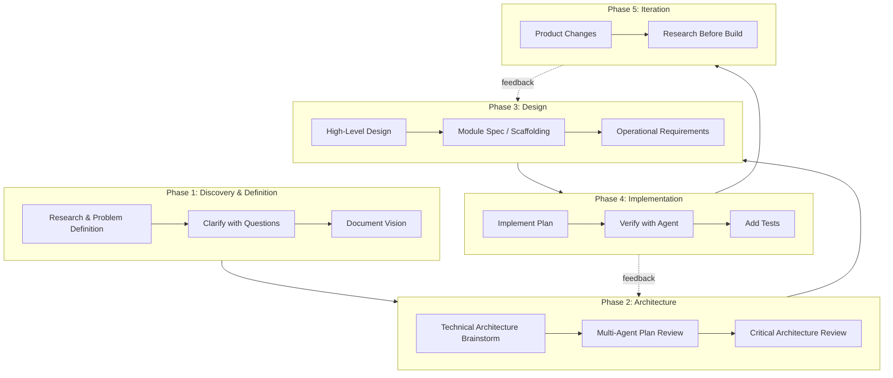

# Build Process: How We've Been Building

A meta-analysis of 15 agent transcripts. This captures the **process** of building — not the app, but the methodology.

---

## The Process Flow (Synthesized)

---

## Step-by-Step Process (Detailed)

### 1. Research & Problem Definition

**What happened in transcripts:**

- User describes high-level flow (e.g., infinite canvas + chat modal)
- Agent reads PLAN.md, DESIGN_GUIDE.md
- Agent asks clarifying questions (AskQuestion) — canvas scope, research scope, collaboration
- No technical details yet

**Output:** Refined product flow, feature list, naming decisions

---

### 2. Technical Architecture Brainstorm

**What happened:**

- After product flow + design docs exist
- Agent acts as "senior technical architect"
- Reads PLAN.md, DESIGN_GUIDE.md, designs/
- Gives pros/cons/alternatives/recommendations for each requirement
- Asks questions across multiple dimensions (edge AI, modularity, LLM config, scalability)

**Output:** Architecture recommendations, ADRs, tech stack decisions

---

### 3. Multi-Agent Plan Review

**What happened:**

- Plans reviewed by 3 separate agents
- Feedback collected and categorized: P0 (critical), P1 (important), P2 (later)
- Founder decides what's crucial vs deferrable
- Items explicitly rejected for V0 documented

**Output:** Prioritized feedback list, decisions on what to implement now vs TECH_DEBT.md

---

### 4. Critical Architecture Review

**What happened:**

- Senior architect review focused on vibe-coding constraints
- Shortcomings, good decisions, questionable decisions
- Emphasis: avoid edge cases that coding agents will struggle with
- Specific fixes: SSE contract, resume state, JSONB schemas, cache normalization

**Output:** Architecture v1.1 patch list, concrete endpoint contracts

---

### 5. High-Level Design (Document Updates)

**What happened:**

- Update ARCHITECTURE.md, PLAN.md, MODULE_SPEC.md
- Add: JSONB schemas, error handling, logging rules, SSE envelope
- Add: ADRs, pitfall list in AGENTS.md
- Plan document updates (Tavily, SSE handoff, stable IDs, structured data)

**Output:** Updated planning docs, single source of truth

---

### 6. Module Spec / Scaffolding

**What happened:**

- MODULE_SPEC.md defines file-by-file specs (function signatures, types, logic)
- Structure before implementation
- Agent reads MODULE_SPEC before implementing any file
- Design tokens in one config (tailwind.config.ts)

**Output:** MODULE_SPEC.md, file structure, type contracts

---

### 7. Operational Requirements

**What happened:**

- Logging strategy: mandatory log points, format, error codes
- User-facing errors: friendly messages + BP-XXXXXX ref codes
- API keys: single command to add (e.g., `echo "TAVILY_API_KEY=..." >> backend/.env`)
- Add to ARCHITECTURE.md, AGENTS.md, DESIGN_GUIDE.md

**Output:** Logging rules, error display rules, config setup

---

### 8. Prompt & Schema Design

**What happened:**

- Critical, non-sycophantic prompt writing
- [FOUNDER] tags for founder to fill
- Few-shot examples, schema validation
- Output schema explicitly stated (Pydantic models)

**Output:** Prompt drafts in prompts.py, schema in models.py

---

### 9. Implement Plan

**What happened:**

- Plan attached for reference
- Todos created, marked in_progress → completed
- Do NOT edit the plan file itself
- Execute in order (PLAN.md → ARCHITECTURE.md → MODULE_SPEC.md → etc.)

**Output:** Code changes, docs updated

---

### 10. Verify with Agent

**What happened:**

- "Are you not using Tavily? I don't see it in the logs" → agent checks, adds journey_id to logs
- Run tests: `pytest backend/tests/`
- Build verification: `npm run build`
- Verify no linter errors

**Output:** Confirmed working, tests pass

---

### 11. Add Tests

**What happened:**

- Research industry standards (WebSearch: LLM testing, DeepEval, Promptfoo)
- 3-tier strategy: unit (mocked), prompt eval (real LLM), E2E
- Mock external services (litellm, Tavily, Supabase)
- Add tests for: llm.py, search.py, api/research.py, prompts.py

**Output:** test_llm.py, test_search.py, test_api.py, test_prompts.py, evals/

---

### 12. Product Changes (Iteration)

**What happened:**

- Explore codebase first (Task/subagent)
- Implement product changes (Refine button, Other option, model update)
- Verify each change (Tavily in logs, prompts updated)

**Output:** Feature additions, incremental improvements

---

### 13. Research Before Build

**What happened:**

- Caching: research free websites (AlternativeTo, SaaSHub)
- Dry run before full implementation — show extracted data
- Understand structure before building

**Output:** Research summary, dry-run results, then implementation

---

## Key Patterns Observed

| Pattern                         | How It Manifests                                                               |
| ------------------------------- | ------------------------------------------------------------------------------ |
| **Read before act**             | Agent reads PLAN.md, ARCHITECTURE.md, MODULE_SPEC.md before any implementation |
| **Ask before assume**           | AskQuestion for scope, preferences, critical decisions                         |
| **Plan before code**            | CreatePlan with todos; implement plan, don't edit plan                         |
| **Review with multiple agents** | Get 3 agents to review; founder prioritizes                                    |
| **Document everything**         | ARCHITECTURE.md, MODULE_SPEC.md, AGENTS.md, TECH_DEBT.md                       |
| **Verify after implement**      | Run tests, check logs, build succeeds                                          |
| **Defer explicitly**            | TECH_DEBT.md for "not now"; FOUNDER_TASKS.md for founder-owned                 |
| **Single source of truth**      | models.py for types, prompts.py for prompts, tailwind.config.ts for design     |

---

## Recommended Process Checklist

Use this as a repeatable checklist for new features or products:

1. [ ] **Research** — Define problem, user flow, scope. Ask clarifying questions.
2. [ ] **Prioritize** — What's P0 vs P1 vs P2? What goes to TECH_DEBT?
3. [ ] **Technical architecture** — Brainstorm, pros/cons, get architect review.
4. [ ] **Multi-agent review** — Get 2–3 agents to review plan. Incorporate feedback.
5. [ ] **High-level design** — Update ARCHITECTURE.md, PLAN.md. Add ADRs.
6. [ ] **Module spec / scaffolding** — Define MODULE_SPEC.md, file structure, types.
7. [ ] **Operational requirements** — Logging, errors, config. Add to AGENTS.md.
8. [ ] **Implement plan** — Create todos, execute, mark complete.
9. [ ] **Verify with agent** — Run tests, check logs, build.
10. [ ] **Add tests** — Unit (mocked), prompt eval (if applicable), E2E.
11. [ ] **Iterate** — Product changes, research before build, dry run when uncertain.

---

## Documents That Anchor the Process

| Document         | Role                                          |
| ---------------- | --------------------------------------------- |
| PLAN.md          | Product scope, tech stack, build phases       |
| ARCHITECTURE.md  | Technical decisions, data flows, ADRs         |
| MODULE_SPEC.md   | File-by-file specs — read before implementing |
| AGENTS.md        | Agent instructions, pitfalls, logging rules   |
| DESIGN_GUIDE.md  | Visual design system                          |
| TECH_DEBT.md     | Deferred items                                |
| FOUNDER_TASKS.md | Founder-authored (prompts, API keys)          |
