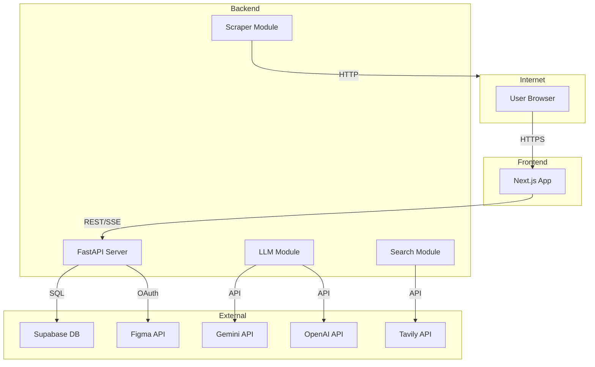

# Blueprint Threat Model

**Generated:** 2026-02-24  
**Scope:** Full Blueprint application (FastAPI backend + Next.js frontend)  
**Branch:** main

---

## Executive Summary

Blueprint is a product/market research tool with moderate security posture. The primary risk themes are:
1. **OAuth token security** - Figma tokens stored in DB, must be protected from unauthorized access
2. **Third-party API credential protection** - LLM/search API keys are high-value targets
3. **Scraper SSRF potential** - URLs from search results could target internal services
4. **Session management** - Anonymous sessions with 30-day cookies

Highest-risk areas requiring attention: codegen session cookie security, OpenAPI exposure, CORS configuration.

---

## Scope and Assumptions

### In-Scope Paths
- `backend/app/` - All FastAPI code
- `frontend/app/`, `frontend/lib/` - Next.js application
- `backend/.env` - Environment configuration (not committed)

### Out-of-Scope
- Railway deployment infrastructure
- Supabase managed service security
- Third-party API provider security (Figma, Gemini, OpenAI, Tavily)

### Explicit Assumptions
1. **A-001:** Application runs behind Railway's TLS termination in production
2. **A-002:** Supabase service key is rotated periodically
3. **A-003:** Environment variables are properly isolated per environment
4. **A-004:** V0 is anonymous-only; no user authentication system
5. **A-005:** CORS origins are properly configured per environment

### Open Questions
- Is rate limiting applied at the edge (Railway/Cloudflare) in addition to app-level?
- Are there any internal services on the deployment network that could be SSRF targets?
- What is the session rotation strategy for long-lived anonymous sessions?

---

## System Model

### Primary Components

| Component | Technology | Purpose |
|-----------|------------|---------|
| Frontend | Next.js 16.x | Landing page, research UI, prototype builder |
| Backend API | FastAPI + Uvicorn | REST API, SSE streaming, OAuth |
| Database | Supabase (PostgreSQL) | Journeys, tokens, cache, sessions |
| LLM Layer | Gemini/OpenAI via litellm | Research synthesis, code generation |
| Search Layer | Tavily/Serper | Web search, Reddit search |
| Scraper | Jina Reader + BS4 | Competitor page content |
| Figma Integration | OAuth 2.0 + REST API | Design import |

### Data Flows and Trust Boundaries

#### Internet → Frontend (Browser)
- **Data types:** HTML/JS/CSS assets, user interactions
- **Protocol:** HTTPS (TLS via Railway)
- **Security:** CSP headers (if configured), SameSite cookies

#### Frontend → Backend API
- **Data types:** Research prompts, Figma URLs, session cookies
- **Protocol:** HTTPS REST/SSE
- **Security:** CORS origin validation, rate limiting, X-Request-Id correlation
- **Validation:** Pydantic models on all inputs

#### Backend → Supabase
- **Data types:** Journeys, tokens, cached data, session state
- **Protocol:** HTTPS (Supabase client)
- **Security:** Service role key (full access), row-level security not enforced in V0
- **Validation:** ORM-style queries prevent SQL injection

#### Backend → Figma API
- **Data types:** OAuth tokens, design node data
- **Protocol:** HTTPS
- **Security:** Per-user/session OAuth tokens stored in DB
- **Validation:** Token refresh on 401, token expiry tracked

#### Backend → LLM Providers
- **Data types:** Prompts (containing user input), design context, images
- **Protocol:** HTTPS via litellm
- **Security:** API keys in env vars, fallback chain on failure
- **Validation:** Pydantic response models, retry logic

#### Backend → Search/Scrape
- **Data types:** Search queries (containing user input), scraped URLs
- **Protocol:** HTTPS
- **Security:** API keys in env vars, semaphore rate limiting
- **Validation:** URL validation missing (see TM-003)

### Diagram

---

## Assets and Security Objectives

| Asset | Why It Matters | Security Objective |
|-------|----------------|-------------------|
| Figma OAuth tokens | Access to user Figma files | Confidentiality, Integrity |
| LLM API keys | Billing, quota, abuse potential | Confidentiality |
| Search API keys | Billing, quota | Confidentiality |
| User research data | Competitive intelligence | Confidentiality (session-scoped) |
| Session cookies | User session hijacking | Integrity |
| Supabase service key | Full database access | Confidentiality |
| Generated prototypes | User work product | Integrity, Availability |

---

## Attacker Model

### Capabilities
- **Remote unauthenticated attacker:** Can make arbitrary HTTP requests to public API
- **XSS attacker (if XSS exists):** Can execute JS in user context, steal localStorage
- **MITM attacker (if TLS fails):** Can intercept non-TLS traffic
- **Malicious search result:** Can inject URLs into scraper pipeline

### Non-Capabilities
- Cannot access server environment variables or secrets
- Cannot bypass Railway's TLS termination
- Cannot directly access Supabase (requires service key)
- Cannot forge OAuth state tokens (cryptographically random)
- Cannot access other users' sessions (session isolation)

---

## Entry Points and Attack Surfaces

| Surface | How Reached | Trust Boundary | Notes | Evidence |
|---------|-------------|----------------|-------|----------|
| `/api/research` | POST with prompt | Internet → Backend | Rate limited, SSE response | `backend/app/api/research.py` |
| `/api/figma/oauth/start` | GET redirect | Internet → Backend → Figma | State cookie CSRF protection | `backend/app/api/figma.py:110` |
| `/api/figma/import` | POST with URL | Internet → Backend | Requires valid session/token | `backend/app/api/figma.py` |
| `/api/code/generate` | POST with design context | Internet → Backend | Session cookie auth | `backend/app/api/codegen.py` |
| `/docs`, `/redoc` | GET | Internet → Backend | OpenAPI exposure | `backend/app/main.py` (default) |
| Scraper URLs | Internal (from search) | Backend → Internet | SSRF potential | `backend/app/scraper.py:42` |

---

## Top Abuse Paths

### 1. Information Disclosure via OpenAPI
**Goal:** Enumerate all API endpoints and schemas  
**Steps:** Access `/docs` or `/openapi.json` in production → Review all endpoints → Identify attack vectors  
**Impact:** Low-Medium - Accelerates targeted attacks

### 2. Session Hijacking via Cookie Theft
**Goal:** Take over anonymous session  
**Steps:** XSS (if exists) → Steal bp_session cookie → Replay in attacker browser  
**Impact:** Medium - Access to user's research/prototypes in that session

### 3. SSRF via Scraper
**Goal:** Access internal services or cloud metadata  
**Steps:** Manipulate search results → Inject internal URL → Scraper fetches internal resource  
**Impact:** Low-Medium - Depends on network topology

### 4. OAuth Token Theft
**Goal:** Access victim's Figma files  
**Steps:** Compromise Supabase access OR SQL injection (not present) → Extract figma_tokens table  
**Impact:** High - Full access to victim's Figma files

### 5. Rate Limit Bypass
**Goal:** DoS via resource exhaustion  
**Steps:** Rotate IPs → Exceed rate limits → Burn LLM API quota  
**Impact:** Medium - Financial impact, service degradation

---

## Threat Model Table

| Threat ID | Threat Source | Prerequisites | Threat Action | Impact | Impacted Assets | Existing Controls | Gaps | Recommended Mitigations | Detection Ideas | Likelihood | Impact Severity | Priority |
|-----------|---------------|---------------|---------------|--------|-----------------|-------------------|------|------------------------|-----------------|------------|-----------------|----------|
| TM-001 | Remote attacker | Production deployment | Access `/docs` to enumerate APIs | Information disclosure | API schema | None | Docs enabled by default | Disable docs in production | Monitor /docs access in production | High | Low | Medium |
| TM-002 | Remote attacker | Session cookie | Exploit missing Secure flag | Cookie sent over HTTP | Session | HttpOnly, SameSite=Lax | Missing Secure flag in codegen | Add secure=True for production | TLS monitoring | Low | Medium | Medium |
| TM-003 | Malicious search result | Search returns malicious URL | SSRF to internal service | Access internal resources | Internal services | Jina proxy layer | No URL validation | Add private IP blocking | Log unusual domains in scraper | Low | Medium | Low |
| TM-004 | Remote attacker | None | Brute-force rate limits | DoS, quota burn | LLM quota, availability | slowapi rate limiting | IP-based only | Add account-based limits in V1 | Monitor rate limit hits | Medium | Medium | Medium |
| TM-005 | XSS attacker | XSS vulnerability exists | Steal localStorage Figma URL | Minimal data exposure | UI state | No XSS sinks found | N/A | Maintain no-XSS posture | CSP violation reports | Low | Low | Low |
| TM-006 | Remote attacker | CORS misconfiguration | Cross-origin credential theft | Session compromise | Session cookies | Origin allowlist | Allows all methods/headers | Restrict CORS methods/headers | Monitor CORS preflight | Low | Medium | Medium |

---

## Criticality Calibration

### Critical (for this repo)
- Unauthorized access to all Figma tokens in database
- Exposure of LLM/Search API keys
- Remote code execution on backend

### High
- Individual session hijacking
- SSRF to cloud metadata (169.254.169.254)
- OAuth state bypass (CSRF to OAuth)

### Medium
- OpenAPI information disclosure
- Rate limit bypass
- Single-user session manipulation

### Low
- UI state exposure (localStorage)
- Minor CORS misconfig without credential impact
- Debug info in error responses

---

## Focus Paths for Security Review

| Path | Why It Matters | Related Threat IDs |
|------|----------------|-------------------|
| `backend/app/main.py` | App factory, CORS, middleware config | TM-001, TM-006 |
| `backend/app/api/figma.py` | OAuth flow, token handling, redirects | TM-002 |
| `backend/app/api/codegen.py` | Session cookie handling | TM-002 |
| `backend/app/scraper.py` | Outbound HTTP requests | TM-003 |
| `backend/app/db.py` | Token storage, DB queries | TM-004 |
| `backend/app/llm.py` | LLM calls, error handling | TM-004 |
| `frontend/app/page.tsx` | localStorage usage, OAuth redirect handling | TM-005 |

---

## Quality Checklist

- [x] All entry points discovered are covered
- [x] Each trust boundary represented in threats
- [x] Runtime vs CI/dev separation clear
- [x] Assumptions explicitly stated
- [x] Open questions documented
- [x] No secrets included in this document

---

**Threat model generated on 2026-02-24**
